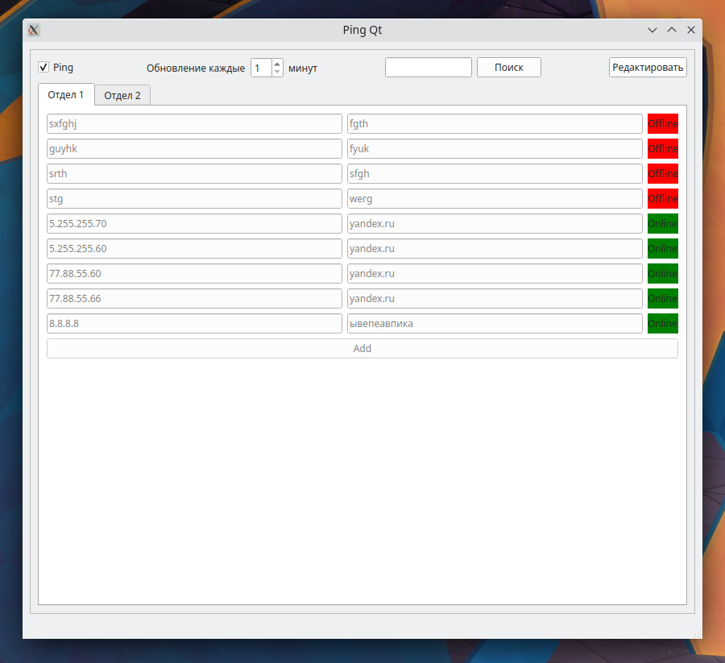

<h2>Описание</h2>

Проект на python (тестировал на python3.10) с оконным интерфейсом, для массового пинга хостов в организации. 

Функцию пинга можно выключить нажав на соответсвующий чекбокс слева и сверху. Можно выставить интервал запуска процедуры проверки активности хостов - выставив обновление в минутах. Реализована функция поиска по ip адресам и именам. В левой графе находится ip адрес хоста, в правой имя пользователя. Несколько вкладок для разделения по отделам. Можно редактировать и добавлять записи. После удачного пинга хоста - справа будет лайбл с зеленым цветом, иначе с красным. 

<h2>Зависимости</h2>

Необходима библиотека для пинга хоствов в python

<code>pip install ping3</code>

Также следует установить библиотеку построения графического интерфейса pyqt

<code>pip install pyside6</code>

Для массового опроса активности хостов необходима библиотека threading

<h3>Запуск</h3>

Если вам необходимо добавить отдел, тогда откорректируйте файл ip.json в соответсвии с его логикой. Добавлять и исправилять записи по хостам вы можете через графический интерфейс.

Запустите скрипт из корня дирректории

<code>python3 mainwindow.py</code>
